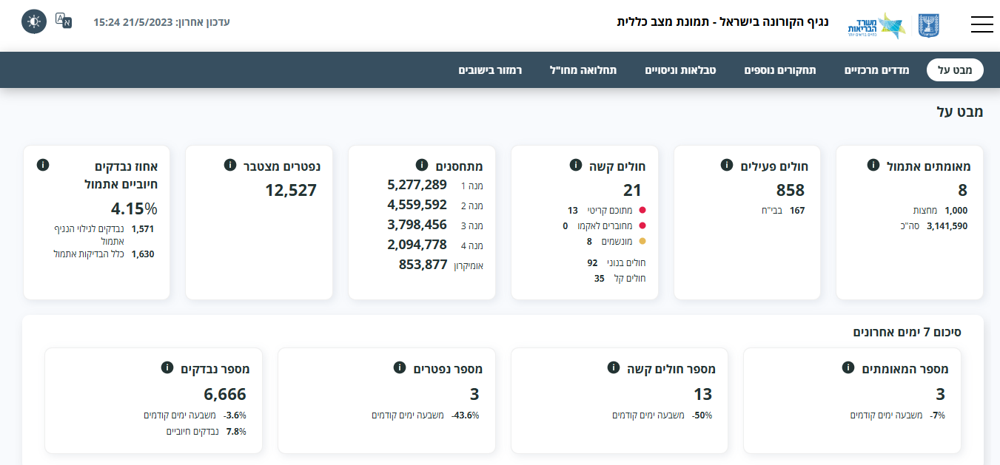
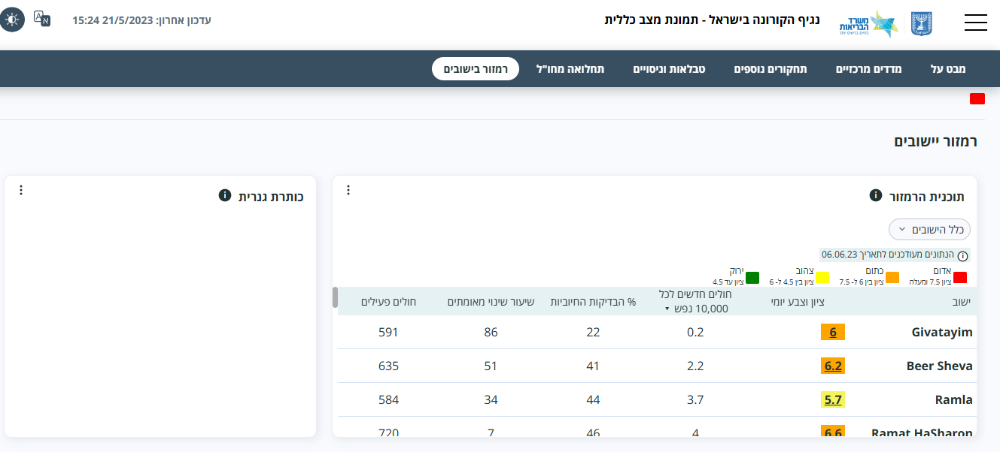
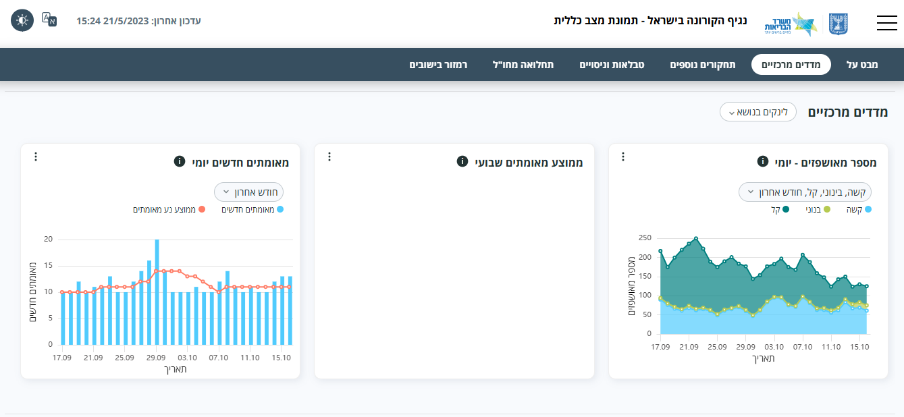
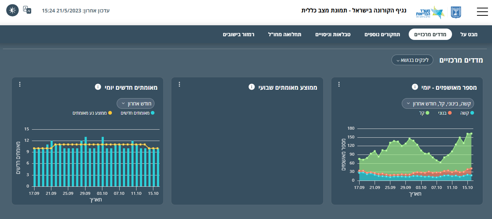

Corona Information Dashboard

אתר תצוגת נתוני קורונה

📖 תיאור כללי

הפרויקט הוא רפליקה של אתר משרד הבריאות הישראלי ומציג נתוני קורונה בצורה ויזואלית וברורה.
המטרה הייתה לתרגל בניית אתר דינמי הכולל גרפים, טבלאות, מצב כהה/בהיר, וממשק מותאם למובייל.

💡 תכונות עיקריות

תצוגת נתונים בטבלאות ניתנות למיון

גרפים אינטראקטיביים באמצעות ECharts

מצב כהה / בהיר

עיצוב רספונסיבי (מותאם למובייל)

ניווט בין קטגוריות שונות של נתונים

🛠️ טכנולוגיות

HTML5, CSS3, JavaScript (Vanilla)

ECharts – להצגת גרפים

Responsive Design

Git / GitHub

📸 תמונות מהפרויקט

